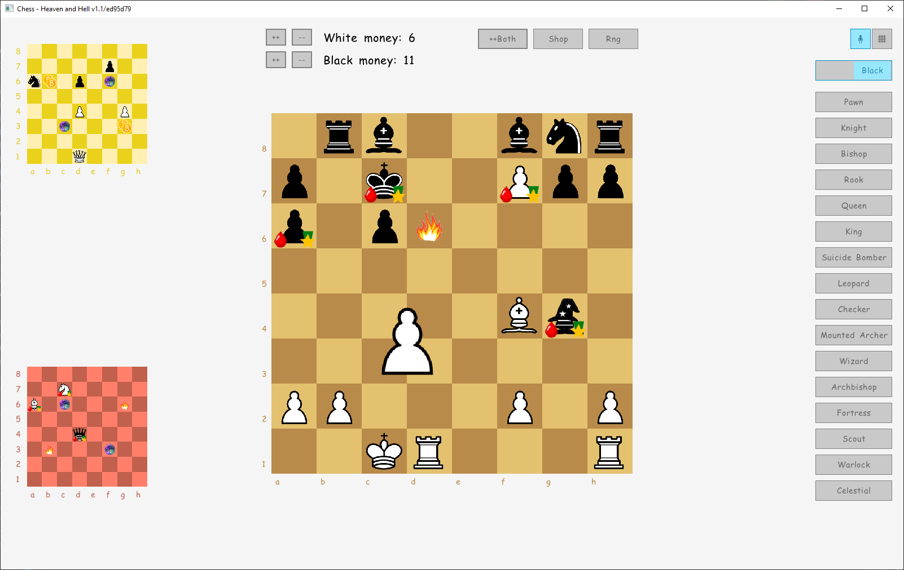

# Chess: Heaven and Hell

*Because traditional chess is not epic enough.*

This is a sandbox designed to play variant chess, particularly my variant Heaven and Hell ([Rules](docs/RULES.md)). No rules are enforced, however. You can move pieces around as you like for maximum flexibility.
The sandbox also has two additional boards, status effects, new pieces, and various items/obstacles that can be placed on tiles.

The sandbox is implemented in [Go](https://go.dev/) using [Raylib](https://www.raylib.com/) and [Raygui](https://github.com/raysan5/raygui).
