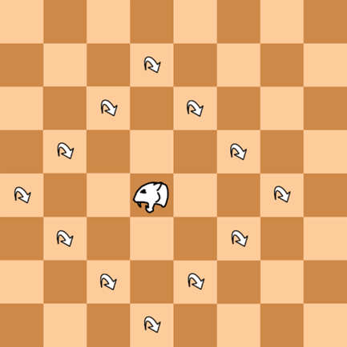
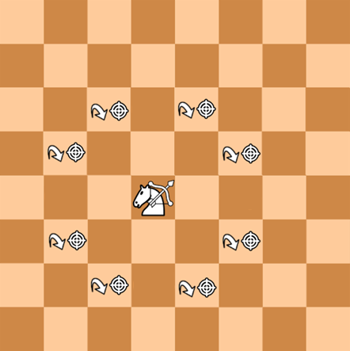
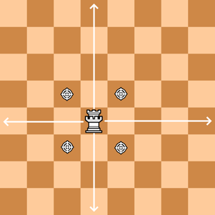

# Heaven and Hell Rules

Normal chess rules apply with the following exception: 
You win either when the enemy has no more Kings anywhere or when the enemy has no more pieces on Earth (the normal board).

Some of the additional rules below allow a player to do other things than move a piece on their turn.
These options (including a standard move of a piece) are called actions, and players can usually do one per turn.
Also note the distinction, that active voice "when you move a piece" refers to moving a piece as an action,
and passive voice "when a piece is moved" refers to a piece moving for any reason, as an action or as a consequence of another action.

Some final terminology:
- "may" means optional,
- an "empty" square has no piece nor item on it,
- an "unoccupied" square has no piece on it but may have an item,
- when a piece is captured, it "dies",
- "adjacent" refers to the 4 touching squares,
- Kings and Queens are "royal" pieces,
- Pawns, Knights, Bishops, Rooks, Kings, and Queens are "standard" pieces,

## Additional rules

### 1 Coins and Shopping

- 1.1 Both players earn one coin after white's turn.
- 1.2 As an action, players can buy an effect from the shop using their coins.
  - 1.2a After an effect has been bought, its price increases by 1 and another effect is unlocked in the shop.
- 1.3 The content of the shop is shuffled at the start of the game and initially only 3 effects are unlocked.

### 2 Other Planes and Movement

- 2.1 There are three 8x8 boards in play. They called Earth, Heaven, and Hell and they are typically referred to as planes.
  - 2.1a The Earth plane is set up as a standard chess board at the start of the game.
  - 2.1b The Heaven plane starts with a Chaos Orb at c3 and at f6 and with two coins at b6 and at g3. 
  - 2.1c The Hell plane starts with a Chaos Orb at c6 and at f3 and with fire at b3 and at g6.
- 2.2 When a piece dies on Earth, it is moved to the same square on a different plane. It goes Hell if it has the Murderer status effect and Heaven otherwise.
  - 2.2a If a piece dies in Heaven or Hell, they are removed from the game.
- 2.3 When a piece captures another piece in Heaven, it is moved to the same square in Hell. 

### 3 Movement

- 3.1 If a piece is moved onto an enemy piece, the enemy piece is captured.
  - 3.1a If a piece is moved onto an enemy piece which cannot be captured due to some other effect, the moving piece dies.
- 3.2 If a piece is moved onto an allied piece, the moving piece dies.
- 3.3 If a piece is moved off the board, even partially, it is dies.

### 4 Items

- 4.1 Coin: When a piece is moved onto a Coin the owner gets one coin.
- 4.2 Fire: When a piece is moved onto or through Fire, it dies (on the fire's square).
- 4.3 Ice: When a piece is moved onto Ice, they must move an additional step in the same direction, even if that moves it off the board or onto an allied piece.
- 4.4 Ice and Fire: If Ice and Fire ever appear on the same square, they are both removed.
- 4.5 Chaos Orb: When a piece is moved onto a Chaos Orb, the owner must pick one of three Chaos Effects to happen.
- 4.6 Secret Trap: When a piece ends a move on a Secret Trap it dies and the trap disappears. A Secret Trap has no visual indication (write your traps down somewhere else).  

### 5 Status Effects

- 5.1 Murderer: The piece is moved to Hell instead of Heaven when it dies on Earth. See rule 2.2.
- 5.2 Experienced: The piece will be upgraded the next time it captures a piece. See section TBD.
- 5.3 Cursed: After you move this piece, it has 25% of dying.
- 5.4 Stunned: You cannot move this piece as an action. This status effect stacks and one is removed at the end of your turn.
- 5.5 Wizard hat: The piece is not affected by Fire and Ice.
- 5.6 Double Move: After you move this piece, you may pay one coin to move it again.
- 5.7 Investor: At the end of white's turn, you get an additional coin. This status effect stacks.
- 5.8 Portal Gun: As an action you can move this piece to the same square on a different plane. This status effect is removed when you do so.
- 5.9 Increased size: This piece takes up more space. This status effect stacks.
  - 5.9a When a piece gets this status effect, it must expand into unoccupied squares if possible. Otherwise, it must expand into squares with enemy pieces, capturing them. If that is also not possible, it dies.
  - 5.9b When a piece with this status effect is captured, it does not die. Instead, it shrinks until it no longer overlaps with the capturing piece. The owner decides whereto. 
- 5.10 Forced movement: The piece must move according to the effect that applied the status effect.

### 6 Experience and Upgrades

- 6.1 When a piece captures another piece it gains the Experienced status effect if it does not have it already.
- 6.2 When a piece with the Experienced status effect captures another piece, it loses the status effect and is upgraded.
- 6.3 When a piece is upgraded it either changes type or gains a status, but the available upgrades depend on its type. The owner of the piece decides which upgrade is applied. Consult the following list for possible upgrades to each piece:
  - Pawn: Knight, Suicide Bomber, Increases Size status effect
  - Knight: Leopard, Checker Knight, Mounted Archer
  - Bishop: Wizard, King, Archbishop
  - Rook: Fortress, Scout, Warlock
  - Angel: *Cannot be upgraded*
  - Imp: *Cannot be upgraded*
  - The rest: Wizard Hat status effect, Investor status effect, Increased Size status effect, Portal Gun status effect (not available for Kings), Double Move status effect (only available for Kings)

### 7 Non-standard Pieces

- 7.1 In the pictures below, these icons have the following meaning:
  - Move: The piece can move along this direction, but not through piece (like a Rook).  
  - Jump: The piece can move directly to this square (like a Knight jump). 
  - Shoot: The piece can capture an enemy piece on this square without moving. 
- 7.2 The non-standard pieces have the following movement patterns and abilities:
  - Suicide Bomber: Moves like a pawn. Creates Fire where it dies.
  - Leopard: Moves like indicated in the picture below.
    - 
  - Checker Knight: Moves like a pawn, but can also jump over an adjacent piece, if the other side is unoccupied. If the Checker Knight jumps over a piece, it may do a second such jump. If the Checker Knight jumps over an enemy piece, the enemy piece is captured.
  - Mounted Archer: Moves like indicated in the picture below.
    - 
  - Wizard: Moves like a Bishop and is not affected by Fire and Ice. As an action, the Wizard can create Fire or Ice on all adjacent unoccupied squares.
  - Archbishop: Moves like a Bishop. Always goes to Heaven when it dies. Allied Pawns in the same rank and file as the Archbishop cannot be captured.
  - Fortress: Moves like indicated in the picture below. An allied King cannot be captured while adjacent to a Fortress.
    - 
  - Scout: In addition to moving like a Rook, the Scout can jump to any corner square of the plane. The Scout is not affected by Secret Traps.
  - Warlock: Moves like a Rook. As an action, the Warlock can move a piece from Hell to the same square on Earth and give it the Cursed status effect. The Warlock always goes to Hell when it dies.
  - Imp: A neutral piece owned by both players. Moves like a Pawn. Both players can take actions with the Imp, but a player is not allowed to immediately undo a move by the other player (unless there are side effects). The Imp is not affected by Fire.
  - Angel: A neutral piece owned by both players. Moves like a Queen. You can only take actions with the Angel if you have the most coins. The Angel is not affected by Ice.
